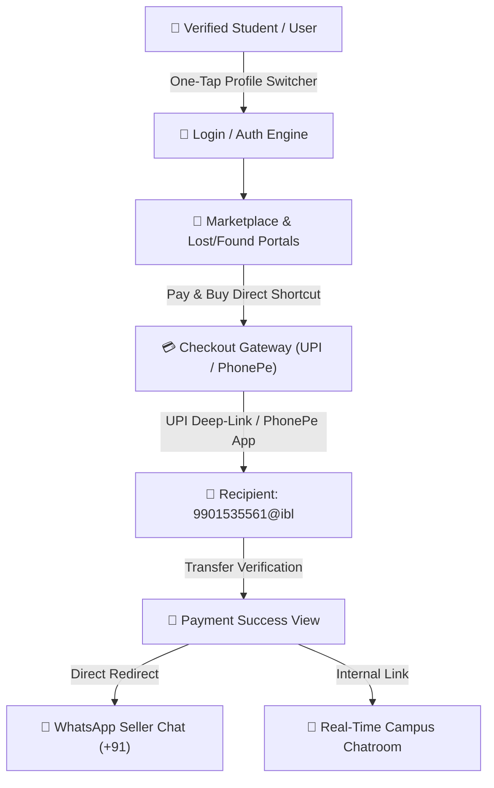

<div align="center">

# 🎓 CampusXchange
### *Next-Generation College Peer-to-Peer Marketplace & Lost/Found Portal*

[](https://suhas-saur.github.io/CampusXchange/)
[](https://github.com/Suhas-Saur/CampusXchange)
[](https://github.com/Suhas-Saur/CampusXchange)
[](https://opensource.org/licenses/MIT)

</div>

---

> [!TIP]
> ### 🌐 **[Click Here to Open the Live Demo](https://suhas-saur.github.io/CampusXchange/)**
> **Permanent Production URL**: `https://suhas-saur.github.io/CampusXchange/`
>
> *Explore full marketplace trading, lost-and-found tracing, PhonePe UPI deep-linking, direct WhatsApp seller routing, and role switcher logins on any desktop or mobile browser!*

---

## 📸 System Architecture & Workflow



---

## 🌟 Core Features

### 1. 🔑 Pre-filled Role Switcher Login
- Switch between **Student** and **Admin** accounts with a single tap.
- Defaults to the **Student Profile** (`student@lnmiit.ac.in` / `password123`) with credentials pre-populated out-of-the-box.
- Tap **Admin Profile** to automatically pre-fill administrator credentials (`admin@lnmiit.ac.in` / `password123`).

### 2. 🛒 Smart Peer-to-Peer Marketplace
- Comprehensive product gallery displaying textbooks, scientific calculators, laptops, and college supplies.
- **Pay & Buy Shortcuts**: Skip detail views and jump directly to checkout from listing cards.

### 3. 📱 Mobile Gateway & UPI Integration
- **Direct Recipient Address**: Transfers set to `9901535561@ibl`.
- **UPI Deep-Linking**: On mobile devices, triggers native application intents (`phonepe://pay`) to launch PhonePe and installed UPI apps instantly.
- **UPI QR Fallback**: On desktop viewports, renders a real-time QR code alongside a 5-minute checkout timer.
- **Razorpay Sandbox**: Integrated support for Razorpay payment simulations.

### 4. 💬 Dynamic Post-Payment Communication Handovers
- **WhatsApp Direct Chat**: After verification, a styled green button launches WhatsApp (+91) with a pre-filled coordinate message:
  > *"Hi! I have just paid ₹[Amount] via UPI for your item "[Title]" on CampusXchange. Let's meet at: [Pickup Location]!"*
- **Open Campus Chat**: Jump into the built-in real-time socket chatroom with the seller.

### 5. 💼 Seller Applications Dashboard
- Search control: **`ENTER ITEM ID TO SEE APPLICATIONS:`**
- Inspect buyer applications by product ID with buyer names, emails, meeting coordinates, request statuses (ACCEPTED/PENDING), and timestamps.

### 6. 📈 Admin Metrics Panels
- Standardized grid view displaying 6 core operational metrics:
  `TOTAL USERS` | `LOST ITEMS` | `FOUND ITEMS` | `MARKETPLACE ITEMS` | `APPLICATIONS` | `MEETINGS`

### 7. 🔌 Database-Free Fallback Mode (100% Offline Coverage)
- Operates smoothly whether connected to a local MongoDB instance (`port 27017`) or running offline via an in-memory mock collection store.
- **Self-Healing Sessions**: Automatically restores active mock user sessions upon backend restarts without throwing 401 exceptions.

---

## 🛠️ Technology Stack

| Layer | Technologies Used |
|---|---|
| **Frontend** | React 18, Vite, TypeScript, Tailwind CSS, Framer Motion, Lucide Icons, Socket.io-client |
| **Backend** | Node.js, Express.js, TypeScript, REST API, Socket.io (WebSockets) |
| **Data Engine** | MongoDB (Mongoose) + In-Memory Fallback Collections |
| **Authentication** | JWT Bearer Tokens, Bcryptjs Password Hashing |
| **Deployments** | GitHub Pages (Client SPA) & Render/Vercel (Full-Stack Engine) |

---

## 📁 Repository Structure

```text
CampusXchange/
├── client/                   # Frontend React + Vite SPA
│   ├── src/
│   │   ├── components/       # UI Buttons, Cards, Inputs
│   │   ├── context/          # AuthContext & SocketContext
│   │   ├── layouts/          # Responsive App Navigation Headers & FAB Menus
│   │   ├── pages/            # Marketplace, Seller Dashboard, Checkout, Messages
│   │   └── services/         # Axios API service (dynamic VITE_API_URL baseURL)
│   ├── index.html
│   └── vite.config.ts
├── server/                   # Backend Express + Node.js Application
│   ├── src/
│   │   ├── config/           # Database Connectors & WebSockets
│   │   ├── controllers/      # Route Logic Handlers (Auth, Payments, Products, Messages)
│   │   ├── middleware/       # JWT Auth & Upload Protectors
│   │   ├── models/           # Mongoose Schemas
│   │   ├── utils/            # In-Memory Mock Data Collections
│   │   └── server.ts         # Runner Entry File (serves static client build in production)
│   └── tsconfig.json
├── package.json              # Root Monorepo Scripts
└── README.md                 # Documentation
```

---

## ⚙️ Quick Start & Local Setup

### 1. Environment Configuration (`.env`)
Create a `.env` file at the root folder (`/CampusXchange/.env`):

```env
PORT=5000
MONGODB_URI=mongodb://127.0.0.1:27017/campusconnect
JWT_SECRET=campusconnect_secure_jwt_token_secret_2026

# College Validation settings
COLLEGE_NAME="LNM Institute of Information Technology"
COLLEGE_EMAIL_DOMAIN="lnmiit.ac.in"

# Razorpay Test Credentials
RAZORPAY_KEY_ID=rzp_test_abc123xyz
RAZORPAY_KEY_SECRET=def456uvw
RAZORPAY_WEBHOOK_SECRET=webhooksecret123
```

### 2. Install Dependencies
```bash
npm run install:all
```

### 3. Build & Run Local Servers
```bash
# Start backend (port 5000) and frontend (port 3000) concurrently
npm run dev
```
Open **`http://localhost:3000`** in your browser.

---

## 👤 Pre-Seeded Test Credentials

| Role | Username / Email | Password |
|---|---|---|
| **Student (Default)** | `student@lnmiit.ac.in` | `password123` |
| **Admin** | `admin@lnmiit.ac.in` | `password123` |
| **Guest Admin** | `admin@campusconnect.demo` | `password123` |

---

## 🚀 Deployment Instructions

### Production Build Script
```bash
npm run build
```
This compiles both the frontend static SPA into `client/dist` and the backend TypeScript files into `server/dist`.

### Production Runner Script
```bash
npm start
```
Executes `node server/dist/server.js` which serves both API endpoints and static client assets on port `5000`.

---

<div align="center">

**Built with ❤️ for Campus Peer-to-Peer Trading**

[🌐 Open Live Demo](https://suhas-saur.github.io/CampusXchange/) • [📦 GitHub Repository](https://github.com/Suhas-Saur/CampusXchange)

</div>
